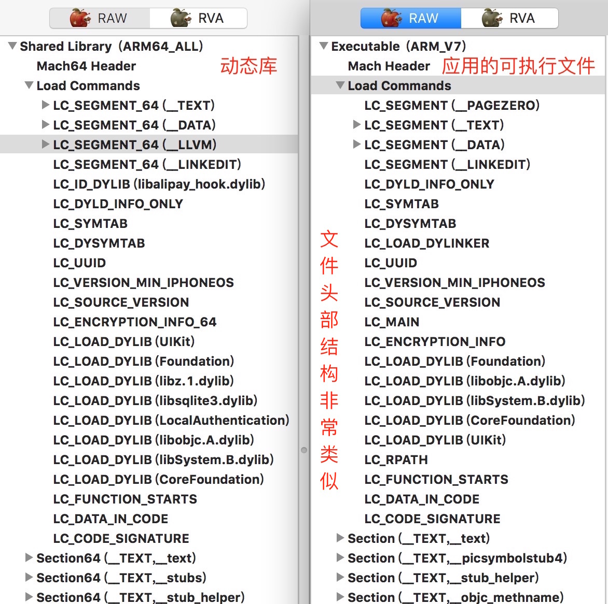
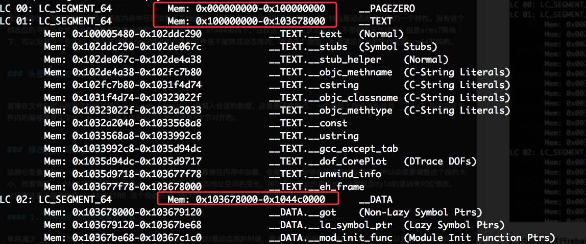
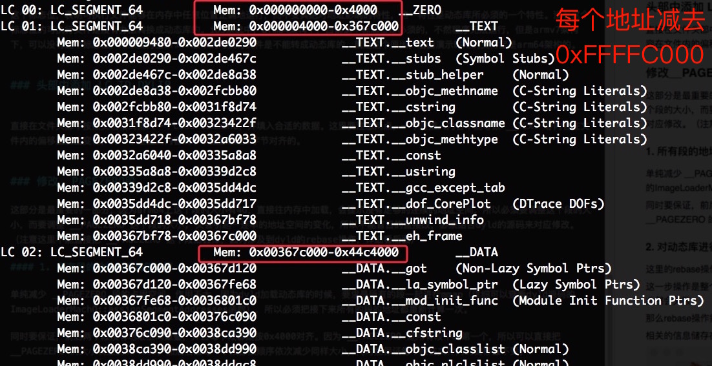
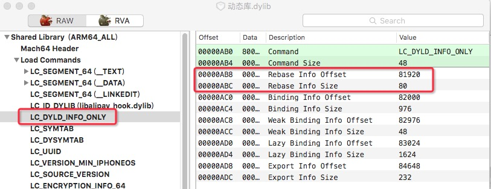
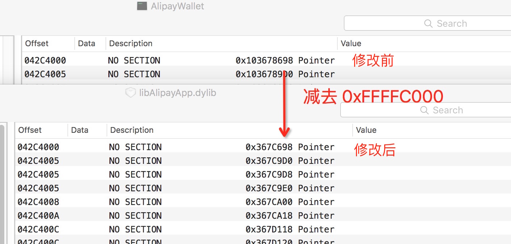
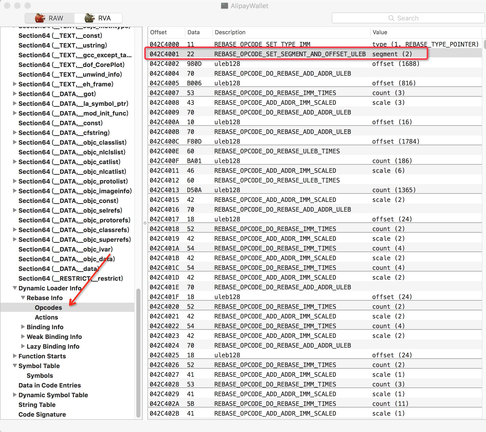
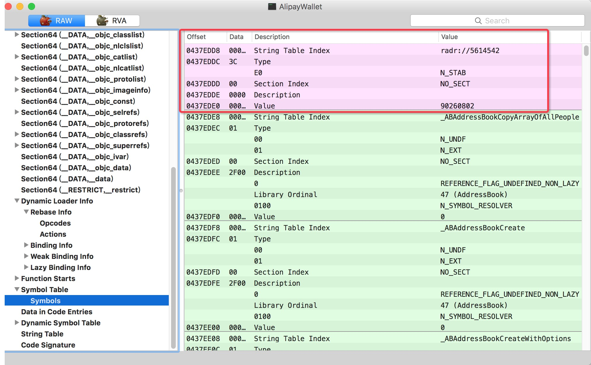
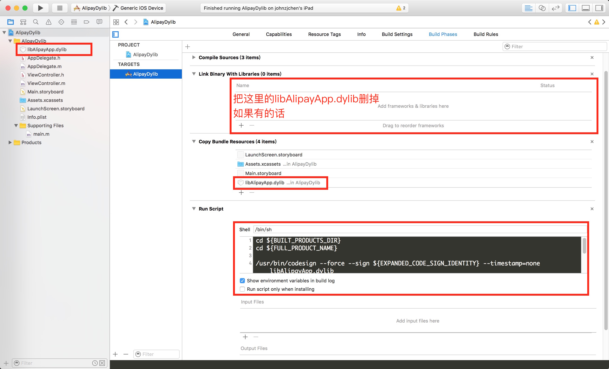

# 前言

本文会介绍一个自己写的工具，能够把第三方iOS应用转成动态库，并加载到自己的App中，文章最后会以支付宝为例，展示如何调用其中的C函数和OC方法。

工具开源地址：
[https://github.com/tobefuturer/app2dylib](https://github.com/tobefuturer/app2dylib)

# 有什么用

为什么要把第三方应用转成动态库呢？与一般的注入动态库+重签名打包的手段有什么不一样呢？

好处主要有下面几点：

1. 可以直接调用别人的算法

   逆向分析别人的应用时，可能会遇到一些私有算法，如果搞不定的话，直接拿来用就好。
   
2. 掌控程序的控制权
   
   程序的主体是自己的App，第三方应用的代码只是以动态库的形式加载，主要的控制权还是在我们自己手里，所以可以直接绕过应用的检测代码（文章最后有关于这部分攻防的讨论）。
   
3. 同个进程内加载多个应用
   
   重签名打包毕竟只能是原来的应用，但是如果是动态库的话，可以同时加载多个应用到进程内了，比如你想同时把美图秀秀和饿了么加载进来也是可以的（秀秀不饿，想想去年大众点评那个APPmixer的软广 - -! ）。


# 应用和动态库的异同

我们要把应用转成动态库，首先要知道这两者之前有什么相同与不同，有相同的才存在转换的可能，而不同之处就是我们要重点关注的了。

### 相同点：


可执行文件和动态库都是标准的 Mach-O 文件格式，两者的文件头部结构非常类似，特别是其中的代码段（TEXT）,和数据段（DATA）结构完全一致，这也是后面转换工作的基础。

### 不同点

不同点就是我们转换工作的重点了，主要有：

1. 头部的文件类型
一个是 MH_EXECUTE 可执行文件， 一个是 MH_DYLIB 动态库， 还有各种头部的Flags，要特别留意下可执行文件中Flags部分的 MH_PIE 标志，后面再详细说。


2. 动态库文件中多一个类型为 LC_ID_DYLIB  的 Load Command, 作用是动态库的标识符，一般为文件路径。路径可以随便填，但是这部分必须要有，是codesign的要求。


3. 可执行文件会多出一个 PAGEZERO段，动态库中没有。这个段开始地址为0（NULL指针指向的位置），是一个不可读、不可写、不可执行的空间，能够在空指针访问时抛出异常。这个段的大小，32位上是0x4000，64位上是4G。这个段的处理也是转换工作的重点之一，之前有人尝试转换，不成功就是因为没有处理好 PAGEZERO.


# 实现细节

### 修改文件类型

第一步是修改文件的头部信息，把文件类型从可执行文件修改成动态库，同时把一些Flags修改好。

这里一个比较关键的Flag是可执行文件中的 MH_PIE 标志位，（position-independent executable）。

这个标志位，表明可执行文件能够在内存中任意位置正确地运行，而不受其绝对地址影响的特性，这一特性是动态库所必须的一个特性。没有这个标志位的可执行文件是没有办法转换成动态库的。iOS系统中，arm64架构下，目前这个标志位是必须的，不然程序无法运行（系统的安全性要求），但是armv7架构下，可以没有这个标志位，所以支付宝armv7版本的可执行文件是不能转成动态库的，就是这个原因。不过所有的arm64的应用都是可以转换的，后面演示时用的支付宝是arm64架构的。


### 头部中添加 LC_ID_DYLIB 


直接在文件头部中按照文档格式插入一个Load Command，并填入合适的数据。这里要注意下插入内容的字节数必须是8字节对齐的。


### 修改PAGEZERO段

这部分是最重要的一部分，因为arm64上这个段的大小有4G，直接往内存中加载，会提示没有足够的连续的地址空间，所以必须要调整这个段的大小，而要调整 PAGEZERO 这个段的大小, 又会引起一连串的地址空间的变化，所以不能盲目的直接改，必须结合dyld的源码来对应修改。（注意这里不能直接把 PAGEZERO 这个段给去掉，也不能直接把大小调成0，因为涉及到dyld的rebase操作，详细看后面）

#### 1. 所有段的地址都要重新计算

单纯减少 PAGEZERO 段的占用空间，作用不大，因为dyld加载动态库的时候，要求是所有的段一起进行mmap（详细可以查看dyld源码的ImageLoaderMachO::assignSegmentAddresses函数），所以必须把接下来所有的段的地址都重新计算一次。

同时要保证，前后两个段没有地址空间重叠，并且每个段都是按0x4000对齐。因为 PAGEZERO 是所有段中的第一个，所以可以直接把  PAGEZERO 的大小调整到0x4000，然后后面每一个段都按顺序依次减少同样大小(0xFFFFC000 = 0x100000000 - 0x4000)，同时能保证每个段在文件内的偏移量不变。

修改前：



修改后：



#### 2. 对动态库进行rebase操作

这里的rebase是系统为了解决动态库虚拟内存地址冲突，在加载动态库时进行的基地址重定位操作。

这一步操作是整个流程里最重要的，因为按照前面的操作，整个文件地址空间已经发生了变化，如果dyld依然按照原来的地址进行rebase，必然会失败。

那么rebase操作需要做哪些工作呢？

相关的信息储存在 Mach-O 文件的 LINKEDIT 段中, 并由 LC_DYLD_INFO_ONLY 指定 rebase info 在文件中的偏移量



详细的rebase信息:


红框里那些Pointer的意思是说，在内存地址为 0x367C698 的地方有一个指针，这个指针需要进行rebase操作, 操作的内容就是和前面调整地址空间一样，每个指针减去 0xFFFFC000。



#### 3. 为什么不能直接去掉PAGEZERO这个段

这个原因要涉及到文件中rebase信息的储存格式，上面的图中，可以看出rebase要处理的是一个个指针，但是实际上这些信息在文件中并不是以指针数组的形式存在，而是以一连串rebase opcode的形式存在，上面看到的一个个指针其实是 Mach O View 这个软件帮我们将opcode整理得到的。



这些opcode中有一种操作比较关键，REBASE_OPCODE_SET_SEGMENT_AND_OFFSET_ULEB。


这个opcode的意思是, 接下去需要调整文件的中的第2个段，就是图中segment(2)所表示的含义。

所以说，如果把PAGEZERO这个段给去掉了，文件中各个段的序号也就都错位了，与rebase中的信息就对应不上了。
而且把这个段大小改为0，也是不行的，因为dyld在加载的过程中，会重新自动过滤掉大小为0的段，也会导致同样的段序号错位的问题。（有兴趣的同学可以看下dyld的源码，在ImageLoaderMachO类的构造函数里）
这就是为什么必须要保留PAGEZERO这个段，同时大小不能为0。

### 修改符号表

正常的线上应用是不存在符号表的，但是如果你之前用了我的另一个工具 [restore-symbol](https://github.com/tobefuturer/restore-symbol) 来恢复符号表的话，这个地方自然也需要做一些处理，处理方法同rebase类似，减去0xFFFFC000.

不过有一些符号需要单独过滤，比如这个：



这个radr://5614542是个什么神奇的符号呢，google就能发现，念茜的twitter上提过这个奇葩的符号。(女神果然是女神, 棒~ 😂)


# 实际效果

工具开源在[github](https://github.com/tobefuturer/app2dylib)上，用法：

1.下载源码编译：

```
git clone --recursive https://github.com/tobefuturer/app2dylib.git
cd app2dylib && make
./app2dylib

```

2.把支付宝arm64砸壳，然后提取可执行文件，用上面的工具把支付宝的可执行文件转成动态库

```
./app2dylib /tmp/AlipayWallet -o /tmp/libAlipayApp.dylib

```

3.用 Xcode 新建工程，并把新生成的dylib拖进去，调整好各项设置.


Run Script里的代码(目的是为了对dylib进行签名)

```
cd ${BUILT_PRODUCTS_DIR}
cd ${FULL_PRODUCT_NAME}
/usr/bin/codesign --force --sign ${EXPANDED_CODE_SIGN_IDENTITY} --timestamp=none libAlipayApp.dylib

```

4.怎么调用动态库里的方法呢？

为方便大家尝试，这里选两个分析起来比较简单的函数调用演示给大家。

一个是OC的方法 +[aluSecurity rsaEncryptText:pubKey:], 可以直接用oc运行时调用。

另一个是C的函数 int base64_encode(char *output, int * output_length, char * input, int input_length) 
这个需要先确定 base64_encode 这个C函数的函数签名和在dylib中的偏移地址（我这边的9.9.3版本是0xa798e4），可以用ida分析得到。

运行结果：


```
#import <UIKit/UIKit.h>
#import <dlfcn.h>

#import <mach/mach.h>
#import <mach-o/loader.h>
#import <mach-o/dyld.h>
#import <objc/runtime.h>


int main(int argc, char * argv[]) {
    
    NSString * dylibName = @"libAlipayApp";
    NSString * path = [[NSBundle mainBundle] pathForResource:dylibName ofType:@"dylib"];
    if (dlopen(path.UTF8String, RTLD_NOW) == NULL){
        NSLog(@"dlopen failed ，error %s", dlerror());
        return 0;
    };
    
    //运行时 直接调用oc方法
    NSString * plain = @"alipay";
    NSString * pubkey = @"MIGfMA0GCSqGSIb3DQEBAQUAA4GNADCBiQKBgQDZ6i9VNEGEaZaYE7XffA9XRj15cp/ZKhHYY43EEva8LIhCWi29EREaF4JjZVMwFpUAfrL+9gpA7NMQmaMRHbrz1KHe2Ho4HpUhEac8M9zUbNvaDKSlhx0lq/15TQP+57oQbfJ9oKKd+he4Yd6jpBI3UtGmwJyN/T1S0DQ0aXR8OQIDAQAB";
    NSString * cipher = [NSClassFromString(@"aluSecurity") performSelector:NSSelectorFromString(@"rsaEncryptText:pubKey:") withObject:plain withObject:pubkey];
    NSLog(@"\n-----------call oc method---------\n明文：%@\n密文： %@\n-----------------------------------", plain,cipher);
    
    //确认dylib加载在内存中的地址
    uint64_t slide = 0;
    for (int i = 0; i <  _dyld_image_count(); i ++)
        if ([[NSString stringWithUTF8String:_dyld_get_image_name(i)] isEqualToString:path])
            slide = _dyld_get_image_vmaddr_slide(i);
    assert(slide != 0);
    
    
    typedef int (*BASE64_ENCODE_FUNC_TYPE) (char * output, int * output_size , char * input, int input_length);
    /** 根据偏移算出函数地址， 然后调用*/
    long long base64_encode_offset_in_dylib = 0xa798e4;
    BASE64_ENCODE_FUNC_TYPE base64_encode = (BASE64_ENCODE_FUNC_TYPE)(slide + base64_encode_offset_in_dylib);
    char output[1000] = {0};
    int length = 1000;
    char * input = "alipay";
    base64_encode(output, & length,  input, (int)strlen(input));
    NSLog(@"\n-----------call c function---------\nbase64: %s -> %s\n-----------------------------------", input,  output);
}
```

ps：示例代码中，我刻意除掉了界面部分的代码，因为支付宝的+load函数里swizzle了UI层的一些方法，会导致crash，如果想干掉那些+load方法的话，看下面。

# 关于绕过检测代码

文章开头的简介中有提到，以动态库的形式加载，能够绕过应用的检测代码，这说法不完全，因为如果把检测代码写在类的+load方法里或者mod_init_func函数（ 全局静态变量的构造函数和```__attribute__((constructor))```指定的函数 ）里，在dylib加载的时候也是可以得到调用的。

那么也就衍生出两种配搭的对抗方案：

i）越狱机
+load方法的调用是在libobjc.dylib中的call_load_methods函数， mod_init_func函数的调用是在dyld中的doModInitFunctions函数，可以直接用CydiaSubstrate inline hook掉这两个函数，而且动态库是由我们自己加载的，所以可以控制hook和加载dylib的时序。

ii) 非越狱机
非越狱机上，没有办法inline hook，但是可以利用_dyld_register_func_for_add_image 这个函数注册回调，这个回调是发生在动态库加载到内存后，+load方法和mod_init_func函数调用前，所以可以在这个回调里把+load方法改名，把mod_init_func段改名等等，也就可以使得各种检测函数没法调用了。

总之，主要的控制权还是在我们手中。

# 工具开源地址

[https://github.com/tobefuturer/app2dylib](https://github.com/tobefuturer/app2dylib)

测试环境：
iPhone 6Plus 、iOS 9.3.1 、arm64
支付宝9.9.3


实际使用过程中，可能会遇到各种奇葩问题，可以去github上提issue，或者email(tobefuturer@gmail.com)，提问时请描述清楚遇到的问题和已经尝试过的解决方法。

# 参考链接&致谢

1. dyld的源码：https://opensource.apple.com/source/dyld/
2. 感谢狗哥的iOS逆向群里 @Ouroboros， @Misty，@张总 三位大神的激烈讨论，还有帮我砸支付宝壳的 @{}
3. 顺便推广下iOS逆向的论坛 [http://iosre.com/](http://iosre.com/)

